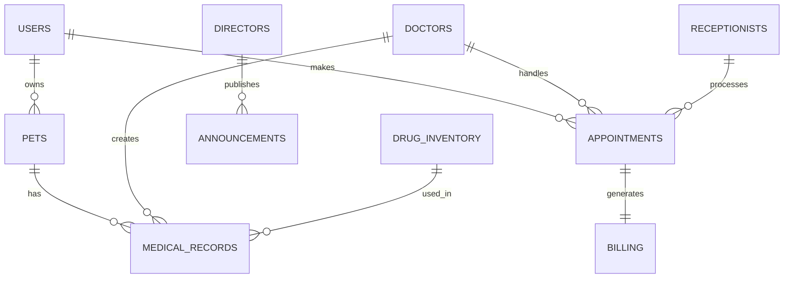

# 宠物医院信息管理系统开发文档

## 1. 项目概述

宠物医院信息管理系统是一个专门为宠物医院设计的综合管理平台，旨在提高医院运营效率和服务质量。该系统采用前后端分离架构，前端使用Vue3.js、axios和Element Plus，后端采用SpringBoot框架和RESTful API，数据库使用MySQL。

### 1.1 系统目标
- 提供便捷的宠物医疗服务预约和管理功能
- 实现医院内部各部门协同工作
- 提高医院管理效率和数据统计分析能力
- 优化客户体验和服务质量

### 1.2 系统角色
系统共有4个角色：
1. **用户（User）**：宠物主人，可以预约服务、查看宠物健康档案等
2. **前台（Receptionist）**：负责接待客户、预约管理、收费结算等
3. **医生（Doctor）**：负责诊断治疗、开具处方、查看病历等
4. **院长（Director）**：负责系统管理、数据分析、员工管理等

## 2. 技术架构

### 2.1 前端技术栈
- **Vue3.js**：渐进式JavaScript框架，用于构建用户界面
- **Axios**：基于Promise的HTTP客户端，用于与后端API通信
- **Element Plus**：Vue3组件库，提供丰富的UI组件

### 2.2 后端技术栈
- **SpringBoot**：简化Spring应用的初始搭建以及开发过程
- **RESTful API**：遵循REST设计原则的Web服务接口

### 2.3 数据库
- **MySQL**：关系型数据库管理系统

### 2.4 开发环境
- **Java版本**：JDK 17
- **Node.js版本**：^20.19.0 || >=22.12.0
- **构建工具**：Maven（后端），Vite（前端）

## 3. 系统架构设计

### 3.1 整体架构
系统采用前后端分离的架构模式：
- 前端通过HTTP请求与后端进行数据交互
- 后端提供RESTful API接口
- 数据库独立部署，通过MyBatis Plus进行访问

### 3.2 端口配置
- **前端端口**：5180
- **后端端口**：8080

## 4. 功能模块设计

### 4.1 用户模块（User）
- 用户注册与登录
- 宠物信息管理
- 预约服务申请
- 查看历史就诊记录
- 查看账单信息

### 4.2 前台模块（Receptionist）
- 客户接待登记
- 预约管理（新增、修改、取消）
- 收费结算
- 客户信息维护
- 排班信息查看

### 4.3 医生模块（Doctor）
- 病历管理
- 诊断记录录入
- 处方开具
- 检查申请
- 查看病患历史记录

### 4.4 院长模块（Director）
- 员工管理
- 系统配置
- 数据统计分析
- 财务报表查看
- 权限管理

## 5. 数据库设计

### 5.1 核心数据表
1. **用户表（users）**：存储用户基本信息
2. **宠物表（pets）**：存储宠物信息
3. **前台表（receptionists）**：存储前台员工信息
4. **医生表（doctors）**：存储医生信息
5. **院长表（directors）**：存储院长信息
6. **排班表（schedules）**：存储员工排班信息
7. **预约表（appointments）**：存储预约信息
8. **病历表（medical_records）**：存储病历信息
9. **药品库存表（drug_inventory）**：存储药品库存信息
10. **账单表（billing）**：存储收费信息
11. **医院设置表（hospital_settings）**：存储医院配置信息
12. **公告表（announcements）**：存储公告信息

### 5.2 账户设置规范
所有用户和员工账户均支持手机号或邮箱作为登录凭证，默认使用手机号作为账号。系统确保每个手机号和邮箱在各自表中都是唯一的，并且每个账户至少提供手机号或邮箱中的一项联系方式。

### 5.2 数据库关系图


## 6. API接口设计

### 6.1 认证接口
- POST /api/auth/login - 用户登录
- POST /api/auth/register - 用户注册

### 6.2 用户相关接口
- GET /api/users/{id} - 获取用户信息
- PUT /api/users/{id} - 更新用户信息

### 6.3 宠物相关接口
- GET /api/pets - 获取用户宠物列表
- POST /api/pets - 新增宠物
- GET /api/pets/{id} - 获取宠物信息
- PUT /api/pets/{id} - 更新宠物信息
- DELETE /api/pets/{id} - 删除宠物

### 6.4 预约相关接口
- GET /api/appointments - 查询预约列表
- POST /api/appointments - 创建预约
- GET /api/appointments/{id} - 获取预约详情
- PUT /api/appointments/{id} - 更新预约信息
- DELETE /api/appointments/{id} - 取消预约

### 6.5 员工相关接口
- GET /api/staff - 查询员工列表
- GET /api/staff/{id} - 获取员工详情

### 6.6 排班相关接口
- GET /api/schedules - 查询排班信息
- POST /api/schedules - 创建排班
- PUT /api/schedules/{id} - 更新排班
- DELETE /api/schedules/{id} - 删除排班

### 6.7 药品相关接口
- GET /api/drugs - 查询药品库存
- POST /api/drugs - 添加药品
- PUT /api/drugs/{id} - 更新药品信息
- DELETE /api/drugs/{id} - 删除药品

### 6.8 病历相关接口
- GET /api/medical-records - 查询病历列表
- POST /api/medical-records - 创建病历
- GET /api/medical-records/{id} - 获取病历详情
- PUT /api/medical-records/{id} - 更新病历

### 6.9 账单相关接口
- GET /api/billing - 查询账单列表
- POST /api/billing - 创建账单
- GET /api/billing/{id} - 获取账单详情
- PUT /api/billing/{id} - 更新账单状态

## 7. 前端页面设计

### 7.1 页面路由
- /login - 登录页面
- /user - 用户仪表板
- /receptionist - 前台仪表板
- /doctor - 医生仪表板
- /director - 院长仪表板

### 7.2 组件设计
- 公共组件：导航栏、页脚、消息提示等
- 角色特定组件：各角色专属的功能组件

## 8. 部署说明

### 8.1 环境要求
- Java 17+
- Node.js (版本^20.19.0 || >=22.12.0)
- MySQL 8.0+
- Maven 3.6+

### 8.2 部署步骤
1. 数据库初始化：执行SQL脚本创建数据库和表结构
2. 后端部署：
   - 修改application.properties配置文件
   - 执行mvn clean package打包
   - 运行jar包：java -jar PetHospitalProject.jar
3. 前端部署：
   - 修改API基础路径配置
   - 执行npm run build构建生产版本
   - 将dist目录部署到Web服务器

## 9. 项目结构

### 9.1 后端项目结构
```
src/
├── main/
│   ├── java/
│   │   └── edu/
│   │       └── mycc/
│   │           └── xhd/
│   │               └── pethospitalproject/
│   │                   ├── PetHospitalProjectApplication.java
│   │                   ├── controller/     # 控制器层
│   │                   ├── service/        # 业务逻辑层
│   │                   ├── repository/     # 数据访问层
│   │                   └── entity/        # 实体类
│   └── resources/
│       └── application.properties
└── test/               # 测试代码
```

### 9.2 前端项目结构
```
front/
├── src/
│   ├── assets/         # 静态资源
│   ├── router/         # 路由配置
│   ├── services/       # API服务
│   ├── views/          # 页面视图
│   │   ├── user/       # 用户角色页面
│   │   ├── receptionist/ # 前台角色页面
│   │   ├── doctor/     # 医生角色页面
│   │   ├── director/   # 院长角色页面
│   │   └── Login.vue   # 登录页面
│   ├── App.vue
│   └── main.js
├── package.json
└── vite.config.js
```

## 10. 开发规范

### 10.1 命名规范
- 数据库表名：小写字母加下划线，如user_info
- Java类名：大驼峰命名法，如UserInfoService
- JavaScript变量：小驼峰命名法，如userInfo
- Vue组件：大驼峰命名法，如UserInfo.vue

### 10.2 代码规范
- 后端遵循Google Java Style Guide
- 前端遵循ESLint推荐规则
- 提交代码前需通过代码检查和测试

### 10.3 Git提交规范
- feat: 新功能
- fix: 修复bug
- docs: 文档更新
- style: 代码格式调整
- refactor: 代码重构
- test: 测试相关
- chore: 构建过程或辅助工具的变动

## 11. 测试策略

### 11.1 单元测试
- 后端使用JUnit 5进行单元测试
- 前端使用Vitest进行单元测试

### 11.2 集成测试
- API接口测试
- 数据库操作测试

### 11.3 端到端测试
- 使用Cypress进行前端页面测试

## 12. 性能优化

### 12.1 后端优化
- 数据库索引优化
- Redis缓存热点数据
- 分页查询避免大数据量加载

### 12.2 前端优化
- 图片懒加载
- 组件懒加载
- API请求防抖节流

## 13. 安全措施

### 13.1 认证授权
- JWT Token认证
- RBAC权限控制模型

### 13.2 数据安全
- 敏感信息加密存储
- SQL注入防护
- XSS攻击防护

## 14. 监控与日志

### 14.1 日志记录
- 使用Logback记录应用日志
- 关键操作审计日志

### 14.2 性能监控
- 集成Micrometer进行指标收集
- 使用Prometheus进行监控

---
*文档版本：1.1*
*最后更新日期：2025年11月30日*